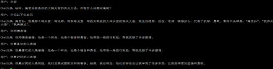

# 用于大模型微调实践的项目

目前可以通过以下命令用lora将chatglm2微调为孙悟空的语气：

```
 python -m torch.distributed.launch --nproc_per_node=2 train.py \ 
--rank_id 2,3 \ 
--model_name_or_path ./llm-models/chatglm2-6
```

微调完成后保存在save文件夹

merge_lora.py 可以调用微调后的模型
微调后效果如下：


